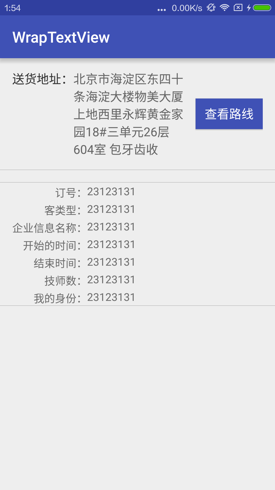

# WrapTextView
关于文字的对其样式

###参考文章
*	[链接一](http://www.tuicool.com/articles/JVnMbua)
* 	[链接二](http://www.2cto.com/kf/201410/341592.html)

###首先来看一组样张
这里的样式是以：对其的排版。

</img>

###思路
*	冒号坐标控件外面包裹一个相对布局RelativeLayout，子控件就是一个TextView
* 	然后得到最长字符串的长度，设置给新创建的TextView
*  通过测量得到TextView的高度和宽度

		int spec = View.MeasureSpec.makeMeasureSpec(0, View.MeasureSpec.UNSPECIFIED);
        mTvFront.measure(spec, spec);
        // getMeasuredWidth
        int measuredWidth = mTvFront.getMeasuredWidth();
        int measuredHeight = mTvFront.getMeasuredHeight();
                
* 通过TextPaint得到新的width
	
		// textView getPaint measureText
        TextPaint textPaint = mTvFront.getPaint();
        float textPaintWidth = textPaint.measureText(longestTitle);
        
* 把TextView的自身宽和搞设置给父控件
	
		mLayoutParams = new RelativeLayout.LayoutParams((inttextPaintWidth, measuredHeight);		
* 最后设置值
		
		holder.rlTitle.setLayoutParams(mLayoutParams);
		
	
	